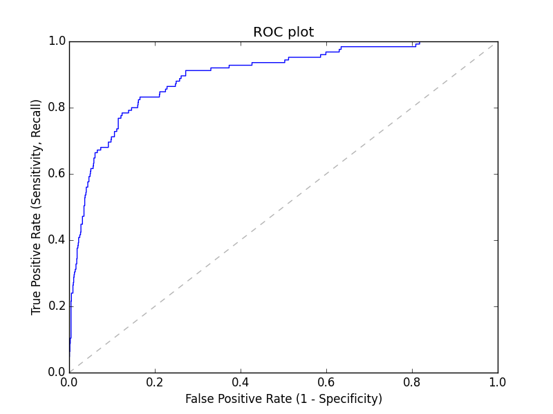
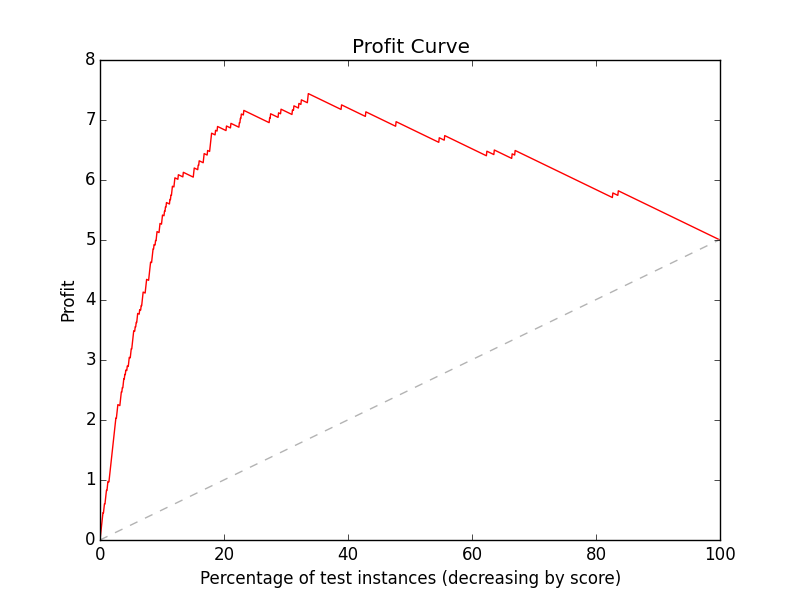

# Cost Benefit Matrices and Profit Curves

We've seen Confusion Matrices and ROC curves as a way to demonstrate the trade-off between False Positives and False Negatives.

This is often referred to as the Precision & Recall tradeoff or the tradeoff between Sensitivity and Specificity.

Basically, would you rather over predict True and get lots of *False Positives* or over predict False and get lots of *False Negatives*?

In the case of a spam filter, it's better to miss some spam and send them to the inbox than to send all the email to spam, so we care more about minimizing FP (misclassifying a real email as spam) than FN. In the case of fraud, we would rather not let fraud slip by, so we care more about minimizing FN than FP.

But *how much more* do we care about FP than FN (or vice versa)? How do we figure out where the sweet spot is?

A *profit curve* enables us to see the the tradeoff in monetary terms, so we can pick a threshold that yields maximum profit!

## Confusion Matrix and ROC Curve Review

Recall that the confusion matrix, which is typically oriented as follows:

|                   | Actual Yes     | Actual No      |
| ----------------- | -------------- | -------------- |
| **Predicted Yes** | True positive  | False positive |
| **Predicted No**  | False negative | True negative  |

This will sometimes have FN and FP swapped. and *sklearn has TN in the upper left!* So, generally, be careful!

If you'd like to review all the terms associated with the confusion matrix, check on the [Wikipedia page for Confusion Matrix](https://en.wikipedia.org/wiki/Confusion_matrix).

Models like Logistic Regression have a threshold that we can vary to make a tradeoff between FN and FP. We can visualize this with an ROC curve.



The best model to pick really depends on our circumstances. We can use *Cost-Benefit Matrices* and *Profit Curves* to be more rigorous about this choice.

You can review the notes from our first day of classification [here](https://github.com/zipfian/logistic-regression/blob/master/lecture.md).

## Cost Benefit Matrix

The first step is to assign a dollar amount to each of the four cells in the confusion matrix.

Say that our classifier is detecting whether a credit card charge is fraudulent. If we think a charge is fraudulent, we will call the customer, which costs us $5. If, however, we catch a fraudulent charge, we save ourselves $100. Since it still costs us the $5, we gain $95.

Here is our Cost-Benefit Matrix:

|                   | Actual Yes | Actual No |
| ----------------- | ---------- | --------- |
| **Predicted Yes** |         95 |        -5 |
| **Predicted No**  |          0 |         0 |

Note that this is built off the baseline of never detecting fraud at all. Also note that the profit could theoretically go negative if we over detect fraud and have our customer service center calling too much.

### Expected Profit

The expected profit of a model is the expected value of the money we will make *per user* by deploying it.

We can calculate this by multiplying the entries of the Cost-Benefit Matrix by the entries of the Confusion Matrix and summing all the values and dividing by the total number of users.

Take a look at the following example Confusion Matrix.

|                   | Actual Yes | Actual No   |
| ----------------- | ---------- | ----------- |
| **Predicted Yes** |        114 |         307 |
| **Predicted No**  |         11 |         818 |

Note that we have a precision of 0.271 and a recall of 0.912.

Here's our calculation for expected profit:

```
Total # of users = 114 + 307 + 11 + 818 = 1250

E(profit) = (114 * 95 + 307 * -5 + 11 * 0 + 818 * 0) / 1250
          = 9295 / 1250
          = 7.436
```

Take a look at the following Confusion Matrix. This may look like it does a better job at prediction, but with our given costs, it's worse in terms of profit.

|                   | Actual Yes | Actual No |
| ----------------- | ---------- | --------- |
| **Predicted Yes** |         47 |        21 |
| **Predicted No**  |         78 |      1104 |

Here we have a precision of 0.376 and a recall of 0.691.

```
E(profit) = (47 * 95 + 21 * -5 + 78 * 0 + 1104 * 0) / 1250
          = 4360 / 1250
          = 3.488
```

Our profit is much worse!

## Profit Curve

Like a ROC Curve shows the FPN and TPN for all the models created by shifting the threshold, the profit curve shows the *profit* for all of those models.

For every possible threshold, we calculate the associated confusion matrix. Then we can calculate the profit like we did above.

Here's what the profit curve will look like:



The dotted gray line shows the profit curve of a random model, so our profit curve should always be above this line.

Here's the pseudocode for computing the profit curve.

```
function profit_curve(costbenefit_matrix, predict_probas, labels):
    Sort instances by their prediction strength (the probabilities)
    For every instance in increasing order of probability:
        Set the threshold to be the probability
        Set everything above the threshold to the positive class
        Calculate the confusion matrix
        Compute the expected profit:
            - multiply each of the 4 entries in the confusion matrix by
            their associated entry in the cost-benefit matrix
            - sum up these values
            - divide by the total number of data points
    return a list of the profits
```

Note the similarity to the pseudocode for the [ROC curve](https://github.com/zipfian/logistic-regression/blob/master/pair.md)!
